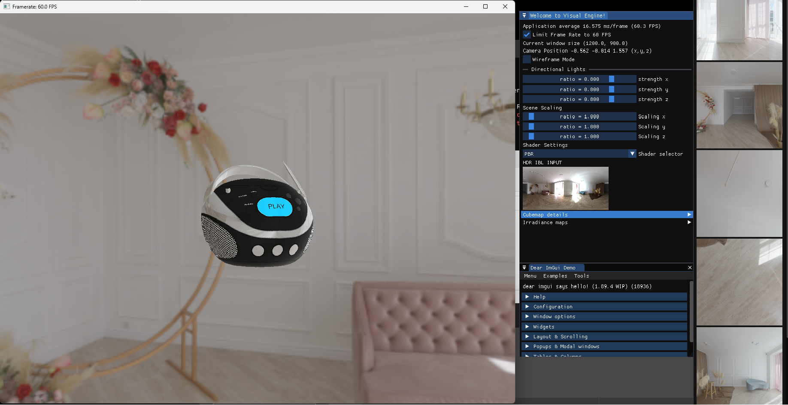
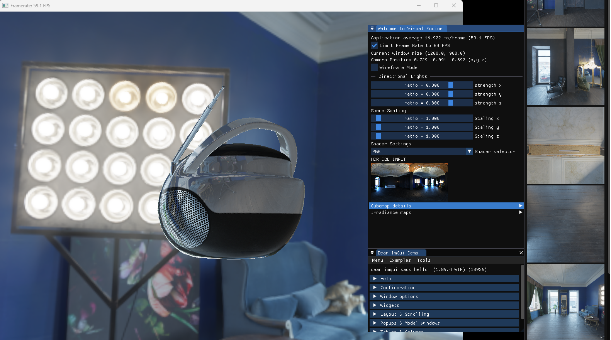
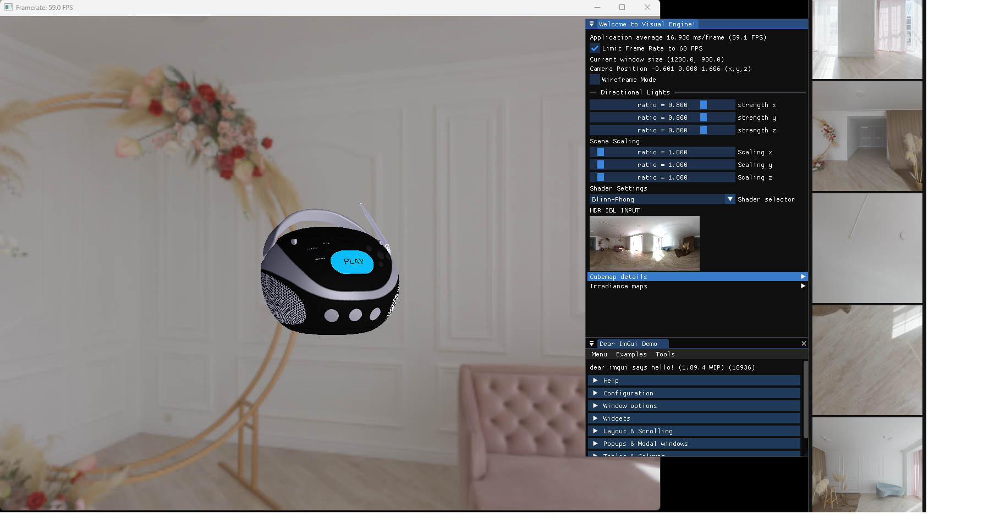

# Visual Engine (preview)
Visual Engine is a real-time DirectX 12 renderer that allows for experimentation with different rendering techniques and shading options.

* The current preview version supports loading glTF 2.0 scenes and is integrated with an imGui user interface for making runtime modifications, which is handy for comparing rendering results and statistics using different rendering methods and combinations at runtime

## Gallerys
PBR with IBL

Blinn Phong

Sample Chess Animatgion (model by Puppetswar Miniatures)

https://github.com/RichardSqd/VisualEngine/assets/100163115/f8da159d-1ebe-42ba-a322-178b92ea08f5

## Features
- glTF 2.0 loading
- Multi-threading: command list recording
- Multiple Lighting paths
- Phong lighting model
- Physically based rendering（PBR）
    - bidirectional reflectance distribution function (BRDF)
    - Image based lighting 
    - HDRI environments to irradiance/specular cubemap convolution
    - HDR to LDR tonemapping 
- Skybox Rendering
- ImGui graphical user interface
- Shader Model 5.0
- MSAA X4 Anti Aliasing 
- Display: VSync 

## In progress
- DirectX Raytracing (DXR) hybrid rendering 
- Multi-threaded command list recording & asset loading

## Build
- Visual Studio 2019+
- Visual C++
- Windows 10 SDK [10.0.18362.0]

## Third party Used
- D3DX12
- DirectXTex
- ImGui
- tinygltf
- KhronosGroup/glTF-Sample
- HDRI Haven
