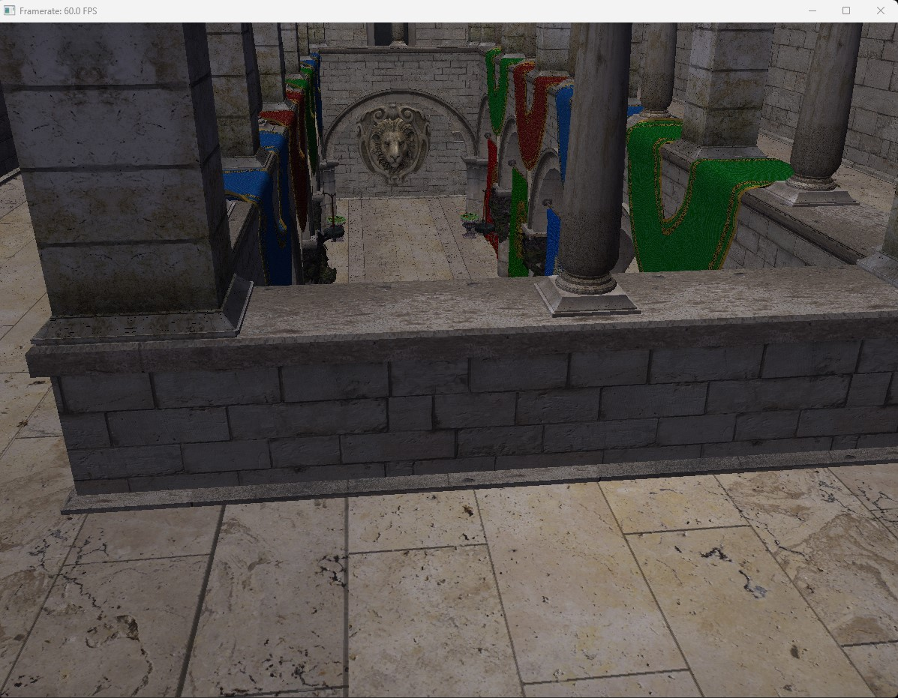

# Visual Engine (preview)
Visual Engine is a multithreaded real-time DirectX 12 renderer that has been developed from scratch, providing the ability to experiment with various rendering techniques and shading options.

* The current preview version supports loading glTF 2.0 scenes and is integrated with an imGui user interface for making runtime modifications, which is handy for comparing rendering results and statistics using different rendering methods and combinations at runtime

## Features
- glTF 2.0 scene loading
- Multi-threaded: command list recording (shadow pass, scene pass)
- Forward & Deferred rendering path
- Phong lighting mode
- Physically based rendering（PBR）
    - bidirectional reflectance distribution function (BRDF)
    - Image based lighting 
    - HDRI environments to irradiance/specular cubemap convolution
    - HDR to LDR tonemapping 
- Skybox Rendering
- Runtime lighting mode switch
- ImGui graphical user interface
- Shader Model 5.0
- MSAA X4 Anti Aliasing 
- VSync

* One of the project's goals is to create a hybrid renderer capable of supporting both the rasterization pipeline and ray tracing pipeline, offering users sufficient control over essential rendering parameters to explore different rendering outcomes. While the current version only supports the rasterization portion, implementing the ray tracing component is a significant milestone that will be accomplished in the near future.

## Gallerys
PBR with IBL

Blinn Phong

Sponza

Sample Chess Animatgion (modeled by Puppetswar Miniatures)

https://github.com/RichardSqd/VisualEngine/assets/100163115/63d84be0-0ec0-4aab-9089-719ca964dc8b

## In progress
- DirectX Raytracing (DXR) hybrid rendering 
- Deferred rendering path

## Build
- Visual Studio 2019+
- Visual C++
- Windows 10 SDK [10.0.18362.0]

## Third party Used
- D3DX12
- DirectXTex
- ImGui
- tinygltf
- stb_image
- KhronosGroup/glTF-Sample
- HDRI Haven
